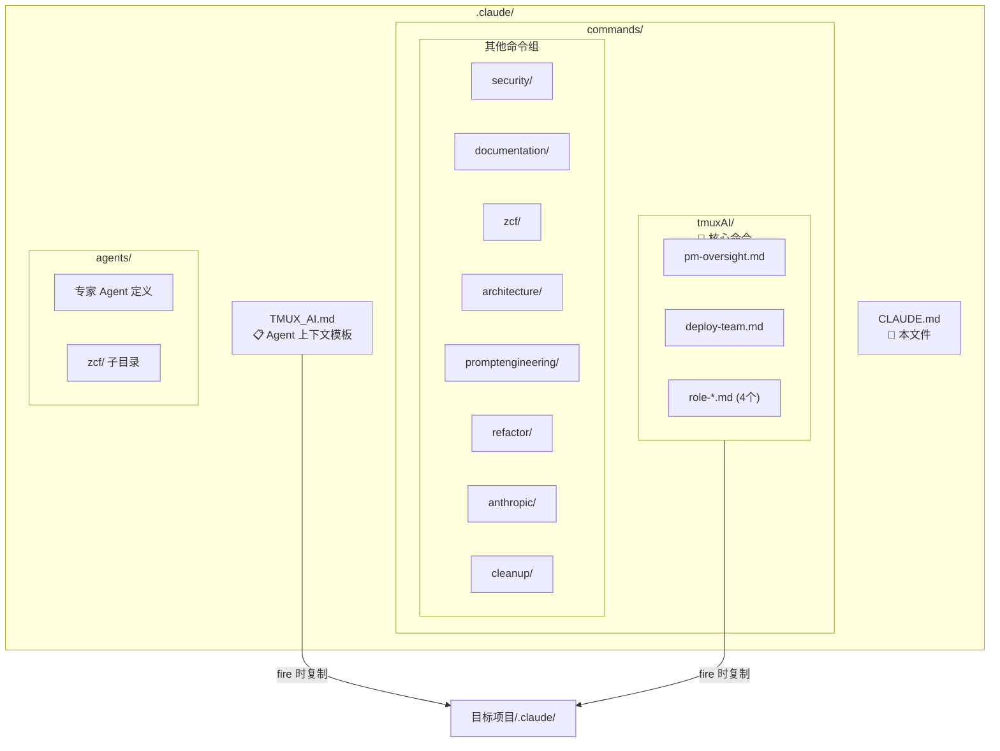

# .claude/ - Claude Code 配置目录

> [← 返回项目根目录](../CLAUDE.md)

## 模块概述

本目录包含 Claude Code 的配置文件、斜杠命令和 Agent 模板。`fire` 启动项目时，部分内容会自动复制到目标项目。

## 目录结构



## 核心文件

| 文件 | 用途 | 复制行为 |
|------|------|----------|
| `TMUX_AI.md` | Agent 工作环境上下文 | fire 时复制到目标项目 |
| `commands/tmuxAI/*.md` | Tmux-AI 核心斜杠命令 | fire 时复制到目标项目 |

## 子目录说明

### commands/
斜杠命令定义，按功能分组：

| 目录 | 命令数 | 说明 |
|------|--------|------|
| `tmuxAI/` | 13 | 核心：PM 槽位管理(7)、团队部署(2)、角色命令(4) |
| `security/` | 9 | 安全审计和测试 (含 test-examples/ 子目录) |
| `zcf/` | 8 | 项目初始化、Git 操作、工作流 |
| `documentation/` | 2 | 文档生成 |
| `refactor/` | 1 | 重构分析 |
| `anthropic/` | 3 | Claude 相关工具 |
| `architecture/` | 1 | 架构模式说明 |
| `promptengineering/` | 2 | 提示词工程 |
| `cleanup/` | 1 | 上下文清理 |

### agents/
专家 Agent 定义：

| Agent | 用途 |
|-------|------|
| `backend-architect.md` | 后端架构设计 |
| `spring-boot-expert.md` | Spring Boot 开发 |
| `react-nextjs-expert.md` | React/Next.js 开发 |
| `ux-design-expert.md` | UX 设计 |
| `code-searcher.md` | 代码搜索分析 |
| `memory-bank-synchronizer.md` | 文档同步 |
| `prompt-engineer.md` | 提示词优化 |
| `design-database-schema.md` | 数据库设计 |

## 文件复制机制

`fire` 函数启动项目时：

1. 检查目标项目是否有 `.claude/TMUX_AI.md`
2. 如果没有，从本目录复制
3. 检查目标项目是否有 `.claude/commands/tmuxAI/`
4. 如果没有，复制整个目录

```bash
# fire 内部逻辑
if [ ! -f "$target/.claude/TMUX_AI.md" ]; then
    cp "$TMUX_AI_TEAM_DIR/.claude/TMUX_AI.md" "$target/.claude/"
fi
if [ ! -d "$target/.claude/commands/tmuxAI" ]; then
    cp -r "$TMUX_AI_TEAM_DIR/.claude/commands/tmuxAI" "$target/.claude/commands/"
fi
```

## 相关链接

- [tmuxAI 命令详情](commands/tmuxAI/CLAUDE.md)
- [Agent 角色指南](../docs/04-agent-roles.md)
