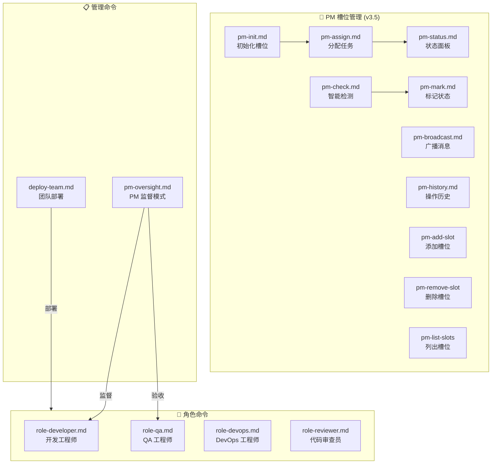

# .claude/commands/tmuxAI/ - Tmux-AI 斜杠命令模块

> [← 返回 .claude 目录](../../CLAUDE.md) | [← 返回项目根目录](../../../CLAUDE.md)

## 模块概述

本目录包含 Tmux-AI 工具包的核心斜杠命令，用于在 Claude Code 中激活各种 Agent 角色和工作模式。

## 命令架构



## 命令索引

### PM 槽位管理命令 (v3.5)

| 命令 | 调用方式 | 用途 |
|------|----------|------|
| pm-init | `/tmuxAI:pm-init` | 初始化槽位（默认创建 dev-1） |
| pm-assign | `/tmuxAI:pm-assign` | 分配任务到槽位 |
| pm-status | `/tmuxAI:pm-status` | 查看槽位状态面板（带过时检测） |
| pm-check | `/tmuxAI:pm-check` | 智能检测槽位状态 |
| pm-mark | `/tmuxAI:pm-mark` | 手动标记槽位状态 |
| pm-broadcast | `/tmuxAI:pm-broadcast` | 广播消息到工作中的槽位 |
| pm-history | `/tmuxAI:pm-history` | 查看 PM 操作历史 |

### 动态槽位管理命令 (v3.5 新增)

| 命令 | Bash 函数 | 用途 |
|------|-----------|------|
| 添加槽位 | `pm-add-slot <name>` | 动态添加新槽位 |
| 删除槽位 | `pm-remove-slot <name>` | 删除槽位并关闭窗口 |
| 列出槽位 | `pm-list-slots` | 显示当前槽位列表 |

> **注意**: `pm-remove-slot` 对工作中的槽位有保护机制，使用 `--force` 会先通知 Agent 再关闭。

### 原有命令

| 命令 | 调用方式 | 用途 |
|------|----------|------|
| pm-oversight | `/tmuxAI:pm-oversight` | PM 监督工程师执行 |
| deploy-team | `/tmuxAI:deploy-team` | 根据规模部署 Agent 团队 |
| role-developer | `/tmuxAI:role-developer` | 激活开发工程师角色 |
| role-qa | `/tmuxAI:role-qa` | 激活 QA 工程师角色 |
| role-devops | `/tmuxAI:role-devops` | 激活 DevOps 工程师角色 |
| role-reviewer | `/tmuxAI:role-reviewer` | 激活代码审查员角色 |

## 使用示例

```bash
# PM 监督模式
/tmuxAI:pm-oversight my-project SPEC: ~/Coding/my-project/spec.md

# 部署团队
/tmuxAI:deploy-team my-project medium

# 激活开发者角色
/tmuxAI:role-developer 实现用户登录功能
```

## 命令参数格式

### pm-oversight
```
<项目名称> [任务描述] [SPEC: <规范文件路径>]
```

### deploy-team
```
<项目名称> [small|medium|large] [SPEC: <规范文件路径>]
```

### role-* 命令
```
<任务描述>
```

## 团队规模配置

| 规模 | 适用场景 | 团队成员 |
|------|----------|----------|
| small | Bug 修复、单一功能 | PM + Developer |
| medium | 新功能、模块重构 | PM + Developer + QA |
| large | 系统重构、新产品 | PM + 2 Dev + QA + DevOps + Reviewer |

## 文件加载机制

这些命令文件在 `fire` 启动项目时会自动复制到目标项目的 `.claude/commands/tmuxAI/` 目录，供该项目的 Claude Code Agent 使用。

## 相关文档

- [PM 监督模式详解](../../../docs/03-pm-oversight-mode.md)
- [Agent 角色指南](../../../docs/04-agent-roles.md)
