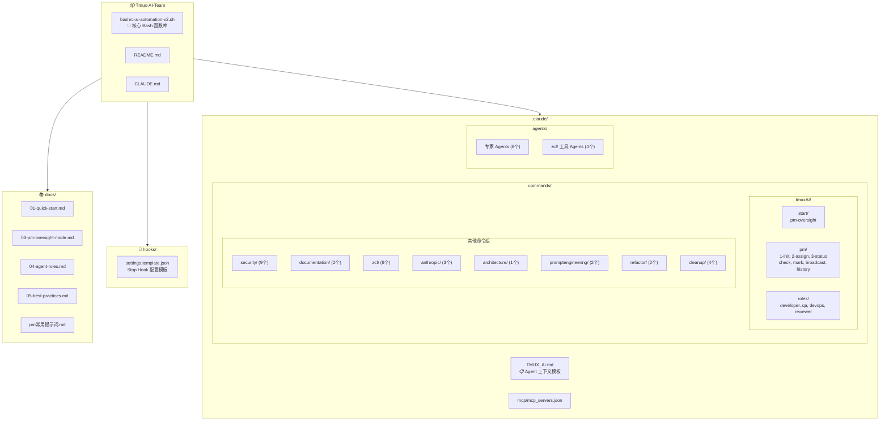
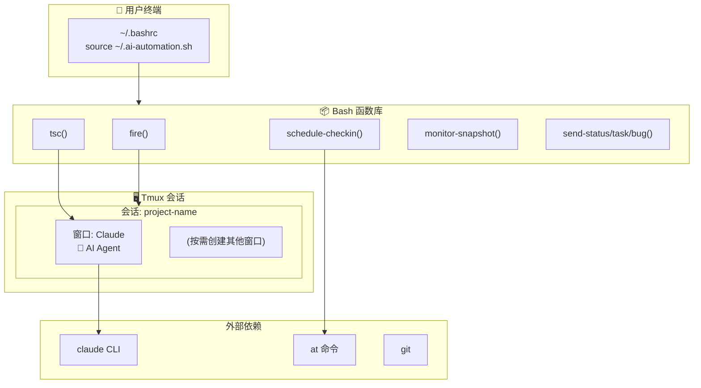
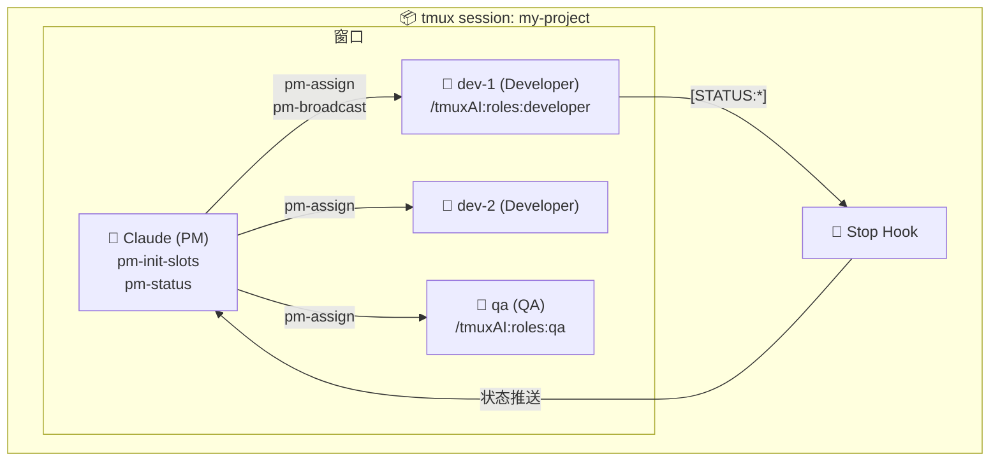
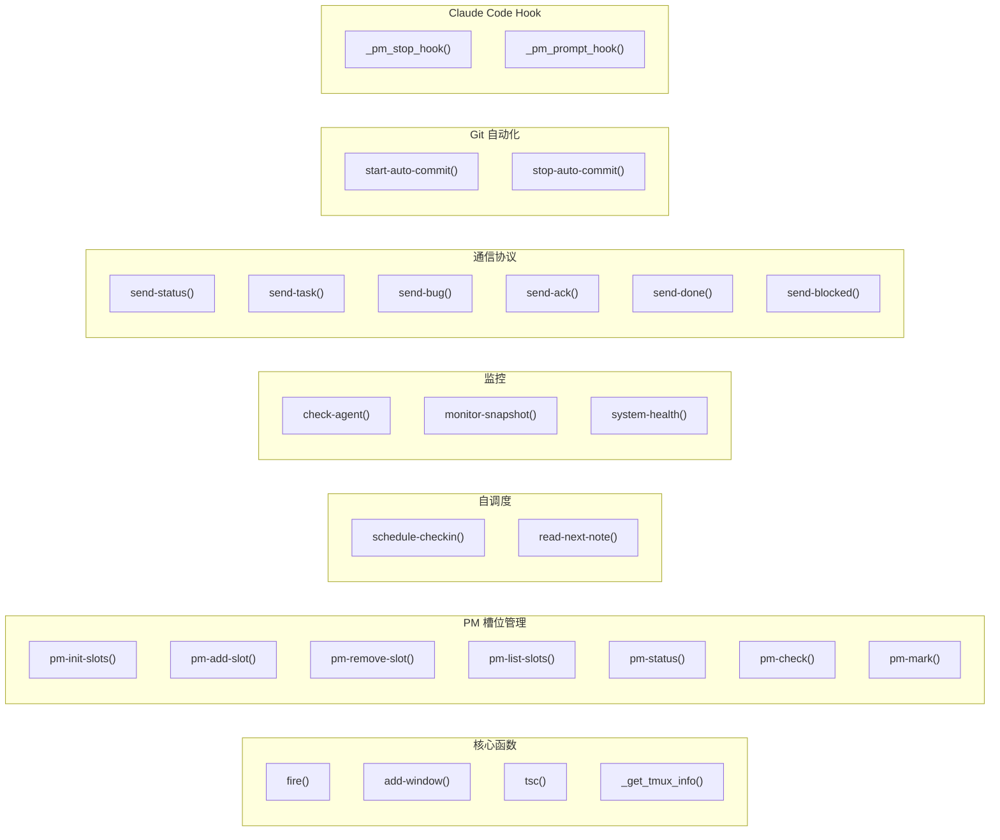

# CLAUDE.md

> Last updated: 2026-01-18

This file provides guidance to Claude Code (claude.ai/code) when working with code in this repository.

## 项目概述

AI 项目自动化工具包 - 将 tmux 与 Claude Code 集成，实现自主开发工作流。

核心功能：
- 在 tmux 会话中启动 Claude Code Agent 进行自主开发
- 自调度：Agent 使用 `at` 命令安排下次检查时间
- PM 监督模式：项目内 PM 自动监督 Engineer Agent（一项目一PM）
- 环境自检：自动检测依赖并提供安装建议

设计文档: @项目隔离PM.md

## 仓库统计

| 指标 | 数值 |
|------|------|
| 核心脚本 | `bashrc-ai-automation-v2.sh` (2464 行) |
| 斜杠命令 | 42 个 (9 个命令组) |
| 专家 Agents | 12 个 |
| 用户文档 | 7 个 |

## 项目结构图



## 架构图

### 运行时架构



### PM 监督模式 (项目内)



**核心原则**:
- 一项目一PM：每个 tmux 会话内有一个 PM
- 窗口即槽位：同一会话内的窗口作为 Agent 槽位
- 窗口名即角色：从窗口名自动推断角色 (`get-role`)

## 模块索引

| 模块 | 路径 | 说明 |
|------|------|------|
| 核心函数库 | [`bashrc-ai-automation-v2.sh`](bashrc-ai-automation-v2.sh) | 所有 Bash 函数定义 (2464 行，17 个部分) |
| Agent 上下文 | [`.claude/TMUX_AI.md`](.claude/TMUX_AI.md) | fire 启动时复制到目标项目 |
| tmuxAI 命令 | [`.claude/commands/tmuxAI/`](.claude/commands/tmuxAI/) | PM、角色命令 (13 个) |
| 其他命令组 | [`.claude/commands/`](.claude/commands/) | security, zcf, documentation 等 (29 个) |
| 专家 Agents | [`.claude/agents/`](.claude/agents/) | 后端架构、代码搜索等专家 (12 个) |
| Hook 集成 | [`hooks/`](hooks/) | Claude Code Hook 配置模板 |
| 用户文档 | [`docs/`](docs/) | 快速开始、使用手册、最佳实践 (7 个) |

### 命令组详情

| 命令组 | 命令数 | 说明 |
|--------|--------|------|
| `tmuxAI/` | 13 | PM 监督、槽位管理、角色定义 |
| `security/` | 9 | 安全审计、提示词注入测试 |
| `zcf/` | 8 | Git 工作流、项目初始化 |
| `cleanup/` | 4 | 上下文优化（分析-预览-归档-执行流水线） |
| `anthropic/` | 3 | Memory Bank、TodoWrite 等 |
| `documentation/` | 2 | README、Release Note 生成 |
| `promptengineering/` | 2 | 提示词工程 |
| `refactor/` | 2 | 重构分析 |
| `architecture/` | 1 | 架构模式说明 |

## 开发与测试

这是一个 Bash 函数库，无需构建。测试方法：

```bash
# 加载函数
source bashrc-ai-automation-v2.sh

# 验证函数已加载
type fire
type tsc

# 测试单个函数（不附加到会话）
bash -c 'source bashrc-ai-automation-v2.sh; fire'  # 列出可用项目

# 语法检查
bash -n bashrc-ai-automation-v2.sh
```

## 核心概念

**一个目录 = 一个 Agent 会话**

工具不区分"项目"和"模块"，只关心目录：

| 用法 | 示例 | 说明 |
|------|------|------|
| 独立仓库 | `fire frontend` | frontend 是独立 git 仓库 |
| Monorepo 子目录 | `fire myapp/frontend` | myapp 是 monorepo |
| 微服务 | `fire user-service` | 每个服务一个目录 |

目录名作为 tmux 会话名，目录路径作为工作目录。

## 核心文件

| 文件 | 用途 |
|------|------|
| `bashrc-ai-automation-v2.sh` | **核心** - 所有 Bash 函数定义 |
| `.claude/TMUX_AI.md` | Agent 上下文模板（fire 启动时复制到目标项目） |
| `.claude/commands/tmuxAI/*.md` | Claude Code 斜杠命令模板 |
| `docs/01-quick-start.md` | **新用户从这里开始** |
| `docs/02-*.md ~ 05-*.md` | 详细使用手册（按序号阅读） |

## 关键函数

### Claude 快捷命令

| 命令 | 说明 | 用途 |
|------|------|------|
| `cld` | `--dangerously-skip-permissions` 模式 | 快速启动，跳过权限确认 |
| `clf` | `--dangerously-skip-permissions` + MCP | 全功能模式，加载 MCP 配置 |

```bash
# 快速模式 - 跳过权限确认
cld

# 全功能模式 - 加载 MCP + IDE 模式
clf

# 等价于
claude --dangerously-skip-permissions --model opus              # cld
claude --dangerously-skip-permissions --model opus --ide --mcp-config ...  # clf
```

**MCP 配置**: `clf` 会自动向上查找 `.claude/mcp/mcp_servers.json`。需要在项目中创建此文件：

```bash
mkdir -p .claude/mcp
```

配置示例 (`.claude/mcp/mcp_servers.json`):
```json
{
  "mcpServers": {
    "playwright": {
      "command": "npx",
      "args": ["@playwright/mcp@latest"]
    }
  }
}
```

### 函数分类概览



### 核心脚本结构 (bashrc-ai-automation-v2.sh)

脚本分为 17 个部分，按功能模块组织：

| 部分 | 行号范围 | 说明 |
|------|----------|------|
| 1. 配置和环境变量 | 16-25 | `CODING_BASE`, `CLAUDE_CMD`, `DEFAULT_DELAY` 等 |
| 2. 内部工具函数 | 27-418 | `_ai_*`, `_resolve_project_path`, `_get_tmux_info` |
| 3. 环境检查 | 420-527 | `check-deps` |
| 4. Claude 快捷命令 | 529-564 | `cld`, `clf` |
| 5. 核心函数 | 566-773 | `tsc`, `get-role`, `fire`, `add-window` |
| 6. 自调度 | 775-818 | `schedule-checkin`, `read-next-note` |
| 7. Git 自动提交 | 820-877 | `start-auto-commit`, `stop-auto-commit` |
| 8. 状态监控 | 879-1038 | `check-agent`, `monitor-agent`, `monitor-snapshot`, `find-window` |
| 9. 通信协议 | 1040-1188 | `send-status`, `send-task`, `send-bug`, `send-ack`, `send-done`, `send-blocked` |
| 10. 日志系统 | 1190-1297 | `init-agent-logs`, `log-message`, `capture-agent-log`, `view-agent-logs` |
| 11. 系统健康检查 | 1299-1447 | `system-health`, `watch-health` |
| 12. 会话管理 | 1449-1468 | `stop-project`, `goto` |
| 13. PM 槽位管理 | 1470-2202 | `pm-init-slots`, `pm-add-slot`, `pm-assign`, `pm-status` 等 |
| 14. Hook 入口 | 2204-2388 | `_pm_stop_hook`, `_pm_prompt_hook` |
| 15. 别名 | 2390-2400 | `ts`, `tw`, `tp`, `send-to-agent` |
| 16. 使用说明 | 2402-2457 | 注释形式的命令速查 |
| 17. 初始化 | 2459-2464 | source 时执行 `_ai_quick_check` |

### 消息发送 (tsc)

向 tmux 窗口发送消息，自动处理 Claude Code 的双 Enter 问题。

```bash
tsc <target> <message>      # 发送消息
tsc -q <target> <message>   # 静默模式
```

详见 [TMUX_AI.md - 消息发送](.claude/TMUX_AI.md#51-消息发送-tsc)

### Tmux 信息获取 (_get_tmux_info)

在任何环境（包括 Hook 后台进程）中获取正确的 tmux 窗口/会话信息。

```bash
_get_tmux_info session   # 获取会话名
_get_tmux_info window    # 获取窗口名
_get_tmux_info both      # 返回 session:window
```

详见 [TMUX_AI.md - 辅助函数](.claude/TMUX_AI.md#71-辅助函数)

### 自调度 (schedule-checkin)

使用 `at` 命令实现 Agent 自我唤醒。详见 [TMUX_AI.md - 自调度机制](.claude/TMUX_AI.md#6-自调度机制)

```bash
schedule-checkin 30 "检查进度"
```

### 项目启动 (fire)

创建 tmux 会话并启动 Claude：

```bash
fire my-project
# → 创建会话（仅 Claude 窗口，其他按需创建）
# → 在 Claude 窗口启动 claude 命令
# → 复制 .claude/TMUX_AI.md 到目标项目
# → 复制斜杠命令到目标项目
# → 直接附加到会话

fire --auto my-project
# → 同上，但会自动发送任务简报
```

### 添加窗口 (add-window)

按需创建额外窗口：

```bash
add-window Shell   # 创建 Shell 窗口
add-window Server  # 创建 Server 窗口
# → 窗口已存在时自动切换到该窗口
```

### 环境自检 (check-deps)

检查所有依赖并提供安装建议：

```bash
check-deps
# → 检查 tmux, claude, git, at 等依赖
# → 显示版本信息和状态
# → 缺失时提供对应系统的安装命令
```

检查分级：
- **L0 致命级**：tmux, claude, CODING_BASE → 阻止关键函数执行
- **L1 重要级**：at, atd, git → 警告但允许继续
- **L2 信息级**：watch, 日志目录 → 仅提示

### Hook 集成 (Stop/Prompt)

实现 PM 监督模式下的推送式状态通知：

| Hook | 触发时机 | 功能 |
|------|----------|------|
| `_pm_stop_hook` | Agent 停止时 | 检测 `[STATUS:*]` 标记，通知 PM |
| `_pm_prompt_hook` | 用户输入时 | 检测人类介入，通知 PM |

详细配置和工作原理请参考 [`hooks/CLAUDE.md`](hooks/CLAUDE.md)

## 配置

环境变量（在 `~/.bashrc` 中设置）：

```bash
export CODING_BASE="$HOME/Coding"   # 项目根目录（所有项目应在此目录下）
export CLAUDE_CMD="claude"          # Claude CLI 命令名
export DEFAULT_DELAY="1"            # tsc 消息发送延迟(秒)
export TMUX_AI_TEAM_DIR="$HOME/Coding/Tmux-AI-Team"  # 本工具包目录
export AGENT_LOG_DIR="$HOME/.agent-logs"  # Agent 日志目录（PM 操作日志、对话捕获等）
```

## 注意事项

- 函数中使用管道的 `while` 循环会创建子shell，变量修改不会影响外部作用域
- 使用 `for` 循环替代 `while read` 管道可避免此问题
- tmux 窗口创建时需指定 `-c` 参数确保正确的工作目录
- `fire` 启动时会自动复制 Agent 上下文和斜杠命令到目标项目

## 引用上下文

@.claude/TMUX_AI.md
