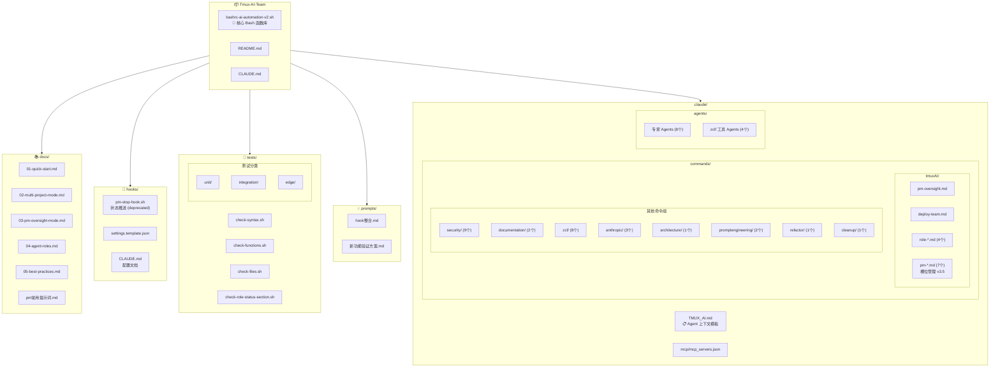
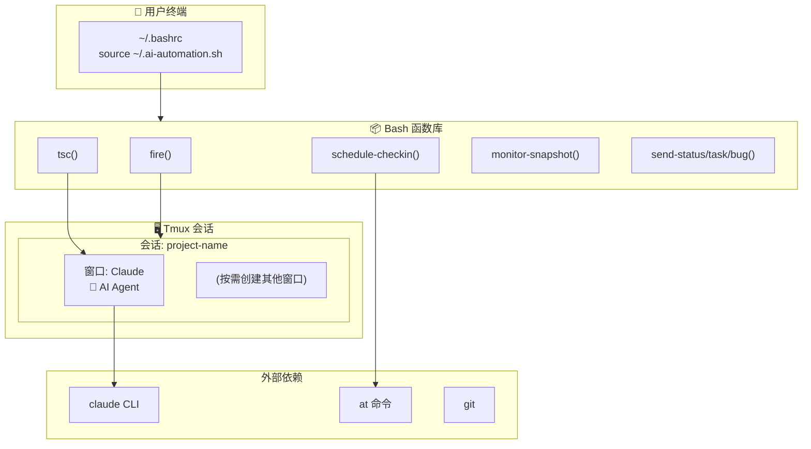
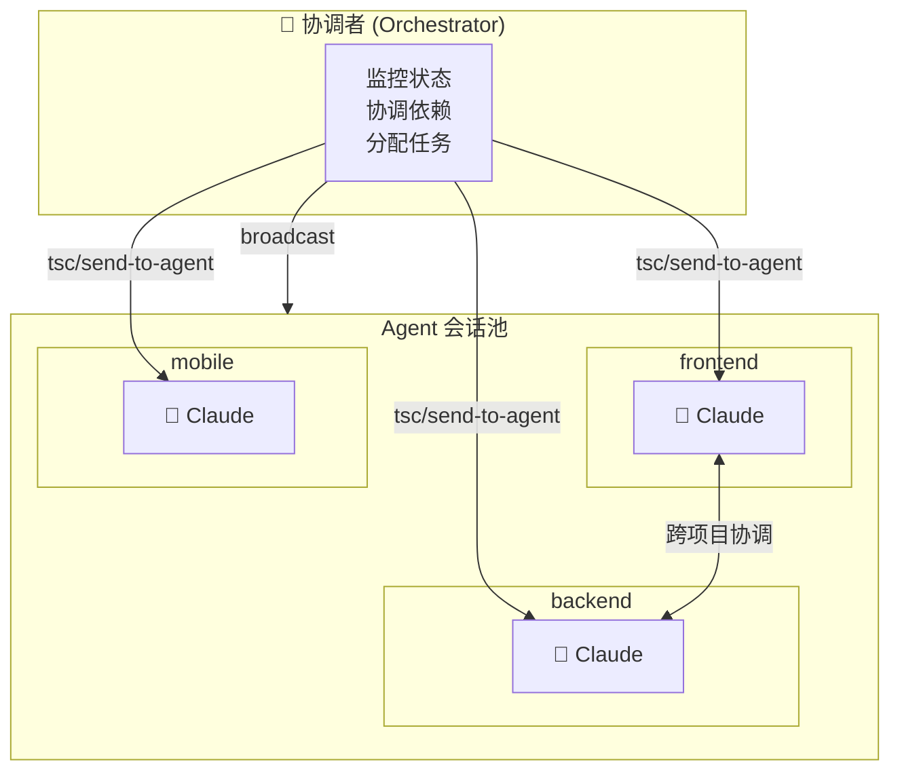
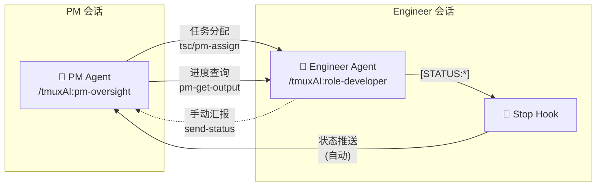
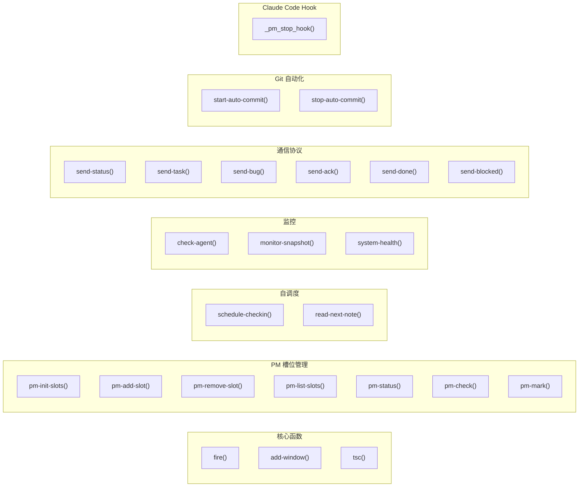

# CLAUDE.md

> 📅 Last updated: 2026-01-11

This file provides guidance to Claude Code (claude.ai/code) when working with code in this repository.

## 项目概述

AI 项目自动化工具包 - 将 tmux 与 Claude Code 集成，实现自主多 Agent 开发工作流。

核心功能：
- 在 tmux 会话中启动 Claude Code Agent 进行自主开发
- 自调度：Agent 使用 `at` 命令安排下次检查时间
- 多 Agent 通信：通过 tmux 消息传递实现跨会话通信
- PM 监督模式：AI 项目经理自动监督 Engineer Agent
- 环境自检：自动检测依赖并提供安装建议

## 项目结构图



## 架构图

### 运行时架构



### 多 Agent 模式



### PM 监督模式



## 模块索引

| 模块 | 路径 | 说明 |
|------|------|------|
| 核心函数库 | [`bashrc-ai-automation-v2.sh`](bashrc-ai-automation-v2.sh) | 所有 Bash 函数定义 (约 2100 行) |
| Agent 上下文 | [`.claude/TMUX_AI.md`](.claude/TMUX_AI.md) | fire 启动时复制到目标项目 |
| 斜杠命令 | [`.claude/commands/tmuxAI/`](.claude/commands/tmuxAI/) | PM、团队部署、角色命令 (13 个) |
| 专家 Agents | [`.claude/agents/`](.claude/agents/) | 后端架构、代码搜索等专家 (12 个) |
| Hook 集成 | [`hooks/`](hooks/) | Claude Code Hook 配置模板，实现状态推送（核心逻辑在 `_pm_stop_hook` 函数） |
| 测试脚本 | [`tests/`](tests/) | 语法检查、函数存在性验证 (4 个) |
| 用户文档 | [`docs/`](docs/) | 快速开始、使用手册、最佳实践 (6 个) |
| 设计文档 | [`prompts/`](prompts/) | Hook 集成设计、功能验证方案 |

## 开发与测试

这是一个 Bash 函数库，无需构建。测试方法：

```bash
# 加载函数
source bashrc-ai-automation-v2.sh

# 验证函数已加载
type fire
type tsc

# 测试单个函数（不附加到会话）
bash -c 'source bashrc-ai-automation-v2.sh; fire'  # 列出可用项目

# 语法检查
bash -n bashrc-ai-automation-v2.sh
```

## 核心概念

**一个目录 = 一个 Agent 会话**

工具不区分"项目"和"模块"，只关心目录：

| 用法 | 示例 | 说明 |
|------|------|------|
| 独立仓库 | `fire frontend` | frontend 是独立 git 仓库 |
| Monorepo 子目录 | `fire myapp/frontend` | myapp 是 monorepo |
| 微服务 | `fire user-service` | 每个服务一个目录 |

目录名作为 tmux 会话名，目录路径作为工作目录。

## 核心文件

| 文件 | 用途 |
|------|------|
| `bashrc-ai-automation-v2.sh` | **核心** - 所有 Bash 函数定义 |
| `.claude/TMUX_AI.md` | Agent 上下文模板（fire 启动时复制到目标项目） |
| `.claude/commands/tmuxAI/*.md` | Claude Code 斜杠命令模板 |
| `docs/01-quick-start.md` | **新用户从这里开始** |
| `docs/02-*.md ~ 05-*.md` | 详细使用手册（按序号阅读） |

## 关键函数

### 函数分类概览



### 消息发送 (tsc)

处理 Claude Code 的软回车问题，需要两次 Enter：

```bash
tsc() {
    tmux send-keys -t "$target" "$message" C-m
    sleep $delay
    tmux send-keys -t "$target" Enter  # 第二次 Enter
}
```

### 自调度 (schedule-checkin)

使用 `at` 命令实现 Agent 自我唤醒：

```bash
schedule-checkin 30 "检查进度"
# → 30 分钟后向当前窗口发送 "继续工作" 消息
```

### 项目启动 (fire)

创建 tmux 会话并启动 Claude：

```bash
fire my-project
# → 创建会话（仅 Claude 窗口，其他按需创建）
# → 在 Claude 窗口启动 claude 命令
# → 复制 .claude/TMUX_AI.md 到目标项目
# → 复制斜杠命令到目标项目
# → 直接附加到会话

fire --auto my-project
# → 同上，但会自动发送任务简报
```

### 添加窗口 (add-window)

按需创建额外窗口：

```bash
add-window Shell   # 创建 Shell 窗口
add-window Server  # 创建 Server 窗口
# → 窗口已存在时自动切换到该窗口
```

### 环境自检 (check-deps)

检查所有依赖并提供安装建议：

```bash
check-deps
# → 检查 tmux, claude, git, at 等依赖
# → 显示版本信息和状态
# → 缺失时提供对应系统的安装命令
```

检查分级：
- **L0 致命级**：tmux, claude, CODING_BASE → 阻止关键函数执行
- **L1 重要级**：at, atd, git → 警告但允许继续
- **L2 信息级**：watch, 日志目录 → 仅提示

### Stop Hook (_pm_stop_hook)

Claude Code Stop 事件触发的 Hook 函数，实现推送式状态通知：

```bash
# 配置方式 (项目 .claude/settings.json):
{
  "hooks": {
    "Stop": [{
      "hooks": [{
        "type": "command",
        "command": "bash -c 'source ~/.ai-automation.sh && _pm_stop_hook'",
        "timeout": 10000
      }]
    }]
  }
}
```

功能：
- 检测 Agent 输出中的 `[STATUS:DONE/ERROR/BLOCKED]` 标记
- 自动调用 `pm-mark` 更新状态（包含耗时计算）
- 向 PM 窗口发送通知消息
- 内置防抖机制（相同状态不重复通知）

详细配置请参考 [`hooks/CLAUDE.md`](hooks/CLAUDE.md)。

## 配置

环境变量（在 `~/.bashrc` 中设置）：

```bash
export CODING_BASE="$HOME/Coding"   # 项目根目录（所有项目应在此目录下）
export CLAUDE_CMD="claude"          # Claude CLI 命令名
export DEFAULT_DELAY="1"            # tsc 消息发送延迟(秒)
export TMUX_AI_TEAM_DIR="$HOME/Coding/Tmux-AI-Team"  # 本工具包目录
export AGENT_LOG_DIR="$HOME/.agent-logs"  # Agent 日志目录（PM 操作日志、对话捕获等）
```

## 注意事项

- 函数中使用管道的 `while` 循环会创建子shell，变量修改不会影响外部作用域
- 使用 `for` 循环替代 `while read` 管道可避免此问题
- tmux 窗口创建时需指定 `-c` 参数确保正确的工作目录
- `fire` 启动时会自动复制 Agent 上下文和斜杠命令到目标项目
