# CLAUDE.md

> 📅 Last updated: 2026-01-11

This file provides guidance to Claude Code (claude.ai/code) when working with code in this repository.

## 项目概述

AI 项目自动化工具包 - 将 tmux 与 Claude Code 集成，实现自主多 Agent 开发工作流。

核心功能：
- 在 tmux 会话中启动 Claude Code Agent 进行自主开发
- 自调度：Agent 使用 `at` 命令安排下次检查时间
- 多 Agent 通信：通过 tmux 消息传递实现跨会话通信
- PM 监督模式：AI 项目经理自动监督 Engineer Agent
- 环境自检：自动检测依赖并提供安装建议

## 项目结构图

```mermaid
graph TB
    subgraph Root["📦 Tmux-AI-Team"]
        CORE["bashrc-ai-automation-v2.sh<br/>🔧 核心 Bash 函数库"]
        README["README.md"]
        CLAUDE["CLAUDE.md"]
    end

    subgraph Docs["📚 docs/"]
        D01["01-quick-start.md"]
        D02["02-multi-project-mode.md"]
        D03["03-pm-oversight-mode.md"]
        D04["04-agent-roles.md"]
        D05["05-best-practices.md"]
    end

    subgraph Hooks["🔗 hooks/"]
        STOP_HOOK["pm-stop-hook.sh<br/>状态推送"]
        HOOK_TEMPLATE["settings.template.json"]
    end

    subgraph Tests["🧪 tests/"]
        T_SYNTAX["check-syntax.sh"]
        T_FUNCS["check-functions.sh"]
        T_FILES["check-files.sh"]
    end

    subgraph Claude[".claude/"]
        TMUX_AI["TMUX_AI.md<br/>📋 Agent 上下文模板"]

        subgraph Commands["commands/"]
            subgraph TmuxAI["tmuxAI/"]
                PM["pm-oversight.md"]
                DEPLOY["deploy-team.md"]
                ROLES["role-*.md (4个)"]
                PMSLOTS["pm-*.md (10个)<br/>槽位管理 v3.5"]
            end
            subgraph Other["其他命令组"]
                SECURITY["security/"]
                DOC["documentation/"]
                ZCF["zcf/"]
            end
        end

        subgraph Agents["agents/"]
            AGENT1["专家 Agents"]
        end
    end

    Root --> Docs
    Root --> Hooks
    Root --> Tests
    Root --> Claude
```



## 架构图

### 运行时架构

```mermaid
flowchart TB
    subgraph User["👤 用户终端"]
        BASH["~/.bashrc<br/>source ~/.ai-automation.sh"]
    end

    subgraph Functions["📦 Bash 函数库"]
        FIRE["fire()"]
        TSC["tsc()"]
        SCHED["schedule-checkin()"]
        MONITOR["monitor-snapshot()"]
        COMM["send-status/task/bug()"]
    end

    subgraph Tmux["🖥️ Tmux 会话"]
        subgraph Session["会话: project-name"]
            W1["窗口: Claude<br/>🤖 AI Agent"]
            W2["(按需创建其他窗口)"]
        end
    end

    subgraph External["外部依赖"]
        CLAUDE_CMD["claude CLI"]
        AT["at 命令"]
        GIT["git"]
    end

    BASH --> Functions
    FIRE --> Session
    TSC --> W1
    W1 --> CLAUDE_CMD
    SCHED --> AT
```



### 多 Agent 模式

```mermaid
flowchart TB
    subgraph Orchestrator["👤 协调者 (Orchestrator)"]
        OPS["监控状态<br/>协调依赖<br/>分配任务"]
    end

    subgraph Agents["Agent 会话池"]
        subgraph S1["frontend"]
            A1["🤖 Claude"]
        end
        subgraph S2["backend"]
            A2["🤖 Claude"]
        end
        subgraph S3["mobile"]
            A3["🤖 Claude"]
        end
    end

    OPS -->|"tsc/send-to-agent"| A1
    OPS -->|"tsc/send-to-agent"| A2
    OPS -->|"tsc/send-to-agent"| A3
    OPS -->|"broadcast"| Agents

    A1 <-->|"跨项目协调"| A2
```



### PM 监督模式

```mermaid
flowchart LR
    subgraph PM_Session["PM 会话"]
        PM["🎯 PM Agent<br/>/tmuxAI:pm-oversight"]
    end

    subgraph Eng_Session["Engineer 会话"]
        ENG["👷 Engineer Agent<br/>/tmuxAI:role-developer"]
        HOOK["🔗 Stop Hook"]
    end

    PM -->|"任务分配<br/>tsc/pm-assign"| ENG
    PM -->|"进度查询<br/>pm-get-output"| ENG
    ENG -->|"[STATUS:*]"| HOOK
    HOOK -->|"状态推送<br/>(自动)"| PM
    ENG -.->|"手动汇报<br/>send-status"| PM
```



## 模块索引

| 模块 | 路径 | 说明 |
|------|------|------|
| 核心函数库 | [`bashrc-ai-automation-v2.sh`](bashrc-ai-automation-v2.sh) | 所有 Bash 函数定义 |
| Agent 上下文 | [`.claude/TMUX_AI.md`](.claude/TMUX_AI.md) | fire 启动时复制到目标项目 |
| 斜杠命令 | [`.claude/commands/tmuxAI/`](.claude/commands/tmuxAI/) | PM、团队部署、角色命令 |
| Hook 集成 | [`hooks/`](hooks/) | Claude Code Hook 脚本，实现状态推送 |
| 测试脚本 | [`tests/`](tests/) | 语法检查、函数存在性验证 |
| 用户文档 | [`docs/`](docs/) | 快速开始、使用手册、最佳实践 |

## 开发与测试

这是一个 Bash 函数库，无需构建。测试方法：

```bash
# 加载函数
source bashrc-ai-automation-v2.sh

# 验证函数已加载
type fire
type tsc

# 测试单个函数（不附加到会话）
bash -c 'source bashrc-ai-automation-v2.sh; fire'  # 列出可用项目

# 语法检查
bash -n bashrc-ai-automation-v2.sh
```

## 核心概念

**一个目录 = 一个 Agent 会话**

工具不区分"项目"和"模块"，只关心目录：

| 用法 | 示例 | 说明 |
|------|------|------|
| 独立仓库 | `fire frontend` | frontend 是独立 git 仓库 |
| Monorepo 子目录 | `fire myapp/frontend` | myapp 是 monorepo |
| 微服务 | `fire user-service` | 每个服务一个目录 |

目录名作为 tmux 会话名，目录路径作为工作目录。

## 核心文件

| 文件 | 用途 |
|------|------|
| `bashrc-ai-automation-v2.sh` | **核心** - 所有 Bash 函数定义 |
| `.claude/TMUX_AI.md` | Agent 上下文模板（fire 启动时复制到目标项目） |
| `.claude/commands/tmuxAI/*.md` | Claude Code 斜杠命令模板 |
| `docs/01-quick-start.md` | **新用户从这里开始** |
| `docs/02-*.md ~ 05-*.md` | 详细使用手册（按序号阅读） |

## 关键函数

### 函数分类概览

```mermaid
graph LR
    subgraph Core["核心函数"]
        fire["fire()"]
        tsc["tsc()"]
    end

    subgraph PMSlots["PM 槽位管理"]
        init["pm-init-slots()"]
        add["pm-add-slot()"]
        remove["pm-remove-slot()"]
        list["pm-list-slots()"]
        pmstatus["pm-status()"]
        pmcheck["pm-check()"]
        pmmark["pm-mark()"]
    end

    subgraph Schedule["自调度"]
        sched["schedule-checkin()"]
        note["read-next-note()"]
    end

    subgraph Monitor["监控"]
        check["check-agent()"]
        snap["monitor-snapshot()"]
        health["system-health()"]
    end

    subgraph Comm["通信协议"]
        status["send-status()"]
        task["send-task()"]
        bug["send-bug()"]
        ack["send-ack()"]
        done["send-done()"]
        blocked["send-blocked()"]
    end

    subgraph Git["Git 自动化"]
        start["start-auto-commit()"]
        stop["stop-auto-commit()"]
    end
```



### 消息发送 (tsc)

处理 Claude Code 的软回车问题，需要两次 Enter：

```bash
tsc() {
    tmux send-keys -t "$target" "$message" C-m
    sleep $delay
    tmux send-keys -t "$target" Enter  # 第二次 Enter
}
```

### 自调度 (schedule-checkin)

使用 `at` 命令实现 Agent 自我唤醒：

```bash
schedule-checkin 30 "检查进度"
# → 30 分钟后向当前窗口发送 "继续工作" 消息
```

### 项目启动 (fire)

创建 tmux 会话并启动 Claude：

```bash
fire my-project
# → 创建会话（仅 Claude 窗口，其他按需创建）
# → 在 Claude 窗口启动 claude 命令
# → 复制 .claude/TMUX_AI.md 到目标项目
# → 复制斜杠命令到目标项目
# → 直接附加到会话

fire --auto my-project
# → 同上，但会自动发送任务简报
```

### 环境自检 (check-deps)

检查所有依赖并提供安装建议：

```bash
check-deps
# → 检查 tmux, claude, git, at 等依赖
# → 显示版本信息和状态
# → 缺失时提供对应系统的安装命令
```

检查分级：
- **L0 致命级**：tmux, claude, CODING_BASE → 阻止关键函数执行
- **L1 重要级**：at, atd, git → 警告但允许继续
- **L2 信息级**：watch, 日志目录 → 仅提示

## 配置

环境变量（在 `~/.bashrc` 中设置）：

```bash
export CODING_BASE="$HOME/Coding"   # 项目根目录（所有项目应在此目录下）
export CLAUDE_CMD="claude"          # Claude CLI 命令名
export DEFAULT_DELAY="1"            # tsc 消息发送延迟(秒)
export TMUX_AI_TEAM_DIR="$HOME/Coding/Tmux-AI-Team"  # 本工具包目录
export AGENT_LOG_DIR="$HOME/.agent-logs"  # Agent 日志目录（PM 操作日志、对话捕获等）
```

## 注意事项

- 函数中使用管道的 `while` 循环会创建子shell，变量修改不会影响外部作用域
- 使用 `for` 循环替代 `while read` 管道可避免此问题
- tmux 窗口创建时需指定 `-c` 参数确保正确的工作目录
- `fire` 启动时会自动复制 Agent 上下文和斜杠命令到目标项目
