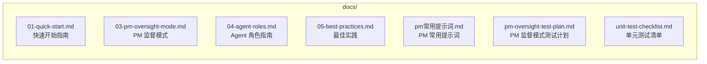

# docs/ - 用户文档

> [<- 返回项目根目录](../CLAUDE.md)

## 模块概述

本目录包含 Tmux-AI-Team 的用户文档，按序号组织，新用户应从 `01-quick-start.md` 开始阅读。

## 目录结构

## 文档索引

| 文件 | 说明 | 阅读顺序 |
|------|------|----------|
| `01-quick-start.md` | 快速开始指南，安装和基础用法 | 1 |
| `03-pm-oversight-mode.md` | PM 监督模式详解，槽位管理和状态追踪 | 2 |
| `04-agent-roles.md` | Agent 角色定义（Developer, QA, DevOps, Reviewer） | 3 |
| `05-best-practices.md` | 使用最佳实践和常见问题 | 4 |
| `pm常用提示词.md` | PM 常用提示词参考 | 参考 |
| `pm-oversight-test-plan.md` | PM 监督模式手动测试计划 | 测试 |
| `unit-test-checklist.md` | 核心函数单元测试清单 (59/59 通过) | 开发 |

## 阅读建议

### 新用户
1. 先阅读 `01-quick-start.md` 完成基础设置
2. 然后阅读 `04-agent-roles.md` 了解角色体系

### 进阶用户
1. 阅读 `03-pm-oversight-mode.md` 学习 PM 监督模式
2. 参考 `pm常用提示词.md` 提高效率

### 团队管理者
1. 重点阅读 `03-pm-oversight-mode.md` 和 `05-best-practices.md`
2. 了解如何协调多个 Agent 协作

### 开发/测试
1. 阅读 `pm-oversight-test-plan.md` 了解手动测试流程
2. 参考 `03-pm-oversight-mode.md` 的技术说明部分了解 Hook 实现

## 相关链接

- [项目根目录 CLAUDE.md](../CLAUDE.md) - 项目整体架构和函数索引
- [斜杠命令参考](../.claude/commands/tmuxAI/README.md) - Tmux-AI 核心命令
- [Agent 上下文模板](../.claude/TMUX_AI.md) - fire 启动时复制到目标项目
