# docs/ - 用户文档模块

> [← 返回项目根目录](../CLAUDE.md)

## 模块概述

本目录包含 Tmux-AI-Team 工具包的完整用户文档，按编号顺序组织，从快速入门到高级最佳实践。

## 文件结构

```mermaid
graph TB
    subgraph Docs["📚 docs/"]
        D01["01-quick-start.md<br/>🚀 快速开始"]
        D02["02-multi-project-mode.md<br/>📊 多项目模式"]
        D03["03-pm-oversight-mode.md<br/>🎯 PM 监督模式"]
        D04["04-agent-roles.md<br/>👥 Agent 角色"]
        D05["05-best-practices.md<br/>✨ 最佳实践"]
        D_PM["pm常用提示词.md<br/>📝 PM 提示词"]
        D_CLAUDE["CLAUDE.md<br/>📄 本文件"]
    end

    D01 --> D02
    D02 --> D03
    D03 --> D04
    D04 --> D05
```

## 文档索引

| 文件 | 内容 | 适合人群 |
|------|------|----------|
| `01-quick-start.md` | 5分钟入门指南、安装、首次启动 | 新用户 |
| `02-multi-project-mode.md` | 同时管理多个 Agent 的 Orchestrator 模式 | 需要多项目协调的用户 |
| `03-pm-oversight-mode.md` | AI PM 自动监督 Engineer Agent、槽位管理 v3.5 | 需要无人值守的用户 |
| `04-agent-roles.md` | 6种 Agent 角色详解和协作方式 | 团队协作用户 |
| `05-best-practices.md` | 使用技巧和经验总结 | 所有用户 |
| `pm常用提示词.md` | PM 常用指令和提示词模板 | PM 模式用户 |

## 阅读顺序建议

1. **新手用户**: 从 `01-quick-start.md` 开始
2. **多项目需求**: 阅读 `02-multi-project-mode.md`
3. **团队协作**: 先读 `04-agent-roles.md`，再读 `03-pm-oversight-mode.md`
4. **提升效率**: `05-best-practices.md`

## 文档维护

- 文档使用 Markdown 格式
- 包含代码示例和命令行输出
- 使用 ASCII 图表展示架构
- 保持与核心代码同步更新
