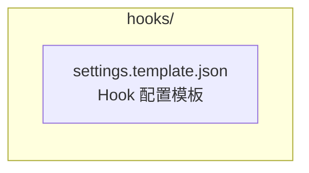
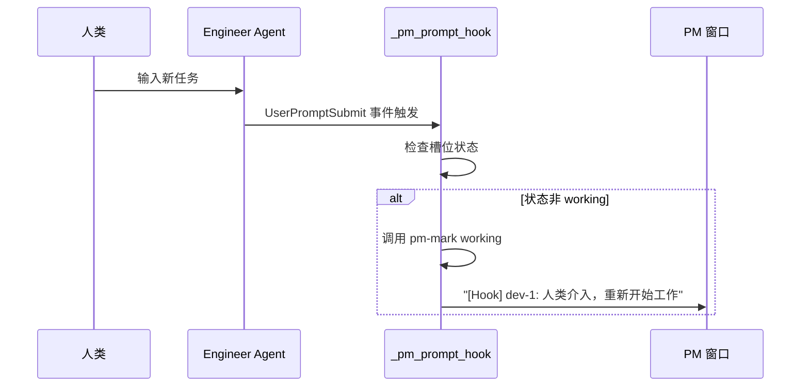
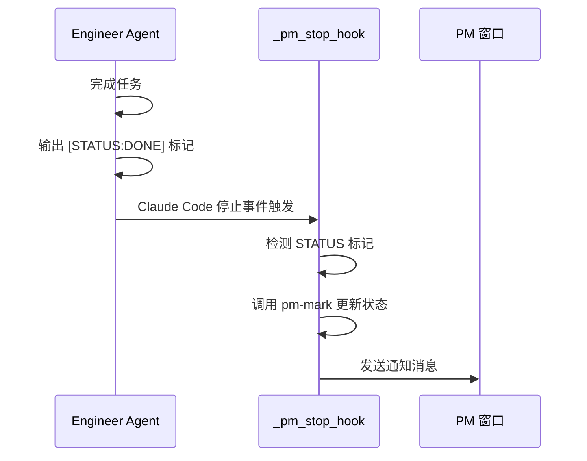

# hooks/ - Claude Code Hook 配置

> [<- 返回项目根目录](../CLAUDE.md)

## 模块概述

本目录包含 Claude Code Hook 的配置模板，用于实现 PM 监督模式下的双向状态同步功能。

## 目录结构



## 核心文件

| 文件 | 说明 |
|------|------|
| `settings.template.json` | Claude Code Hook 配置模板（含 Prompt + Stop） |

## Hook 机制概览

```
┌─────────────────────────────────────────────────────────────────────────┐
│                         双向 Hook 机制                                  │
├─────────────────────────────────────────────────────────────────────────┤
│                                                                          │
│  人类/PM 输入     UserPromptSubmit Hook      Agent 工作结束              │
│       │                   │                        │                     │
│       ▼                   ▼                        ▼                     │
│  ┌─────────┐        ┌─────────────┐         ┌───────────┐               │
│  │ prompt  │───────▶│ _pm_prompt  │         │  [STATUS  │               │
│  │ 提交    │        │   _hook     │         │   :DONE]  │               │
│  └─────────┘        └──────┬──────┘         └─────┬─────┘               │
│                            │                      │                      │
│                            ▼                      ▼                      │
│                     ┌──────────────┐       ┌─────────────┐              │
│                     │ 检测槽位状态  │       │ Stop Hook   │              │
│                     │ 非 working?  │       │ _pm_stop    │              │
│                     └──────┬───────┘       │  _hook      │              │
│                            │               └──────┬──────┘              │
│                            ▼                      │                      │
│                     ┌──────────────┐              ▼                      │
│                     │ pm-mark      │       ┌──────────────┐             │
│                     │ → working    │       │ pm-mark      │             │
│                     └──────┬───────┘       │ → done/error │             │
│                            │               └──────┬───────┘             │
│                            ▼                      ▼                      │
│                     ┌──────────────────────────────────┐                │
│                     │           通知 PM 窗口            │                │
│                     │  "[Hook] dev-1: 人类介入..."      │                │
│                     │  "[Hook] dev-1 → done: ..."      │                │
│                     └──────────────────────────────────┘                │
│                                                                          │
└─────────────────────────────────────────────────────────────────────────┘
```

## Hook 类型

### 1. UserPromptSubmit Hook (检测开始)

**触发时机**：用户提交 prompt 时

**解决问题**：当人类直接介入 Agent 工作时，PM 不知道 Agent 重新开始工作

**工作流程**：


### 2. Stop Hook (检测结束)

**触发时机**：Claude Code 停止执行时

**解决问题**：Agent 完成任务后自动通知 PM

**工作流程**：


## 状态标记协议

Agent 在输出中使用以下标记向 PM 汇报状态：

| 标记 | 含义 | PM 行为 |
|------|------|---------|
| `[STATUS:DONE]` | 任务完成 | 标记为 done，发送通知 |
| `[STATUS:ERROR]` | 遇到错误 | 标记为 error，发送告警 |
| `[STATUS:BLOCKED]` | 任务阻塞 | 标记为 blocked，发送告警 |
| `[STATUS:PROGRESS]` | 进度更新 | 仅显示进度，不改变状态 |

## 配置方法

1. 将 `settings.template.json` 复制到目标项目的 `.claude/settings.json`
2. 确保 `~/.ai-automation.sh` 已加载（包含 Hook 函数）

```bash
# 复制配置模板
cp hooks/settings.template.json /path/to/project/.claude/settings.json
```

## 核心函数

### _pm_prompt_hook

检测人类介入，更新状态为 working：

```bash
_pm_prompt_hook() {
    # 读取 Claude Code 传入的 prompt
    # 检查当前槽位状态
    # 如果非 working，更新为 working 并通知 PM
    # 内置防抖：已经是 working 则跳过
}
```

### _pm_stop_hook

检测任务结束，更新状态并通知 PM：

```bash
_pm_stop_hook() {
    # 检测 Agent 输出中的 [STATUS:*] 标记
    # 自动调用 pm-mark 更新状态
    # 向 PM 窗口发送通知消息
    # 内置防抖机制（相同状态不重复通知）
}
```

## 使用示例

### 场景 1: PM 分配任务

```
PM: pm-assign dev-1 developer "实现登录 API"
    ↓
dev-1: 开始工作... (状态: working)
    ↓
dev-1: [STATUS:DONE] 登录 API 完成
    ↓ Stop Hook
PM 收到: [Hook] dev-1 → done: 登录 API 完成
```

### 场景 2: 人类直接介入

```
dev-1 状态: done (上一任务完成)
    ↓
人类: 在 dev-1 窗口输入 "优化性能"
    ↓ Prompt Hook
PM 收到: [Hook] dev-1: 人类介入，重新开始工作 (prompt: 优化性能...)
    ↓
dev-1: 开始优化... (状态: working)
    ↓
dev-1: [STATUS:DONE] 性能优化完成
    ↓ Stop Hook
PM 收到: [Hook] dev-1 → done: 性能优化完成
```

## 相关链接

- [项目根目录 CLAUDE.md](../CLAUDE.md) - 项目整体架构
- [PM 监督模式文档](../docs/03-pm-oversight-mode.md) - 详细使用说明
- [核心函数库](../bashrc-ai-automation-v2.sh) - Hook 函数实现 (行 2204-2388)
- [斜杠命令库](../.claude/commands/CLAUDE.md) - 所有斜杠命令
- [PM 槽位管理命令](../.claude/commands/tmuxAI/README.md) - tmuxAI 命令导航
