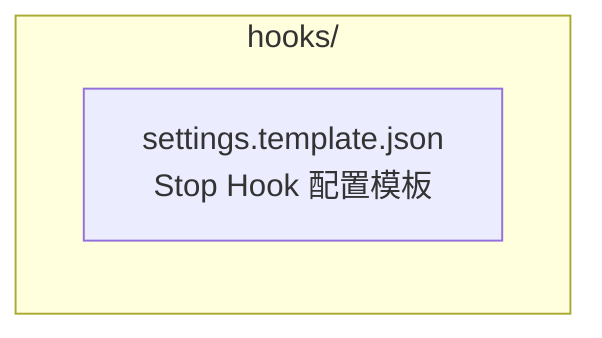
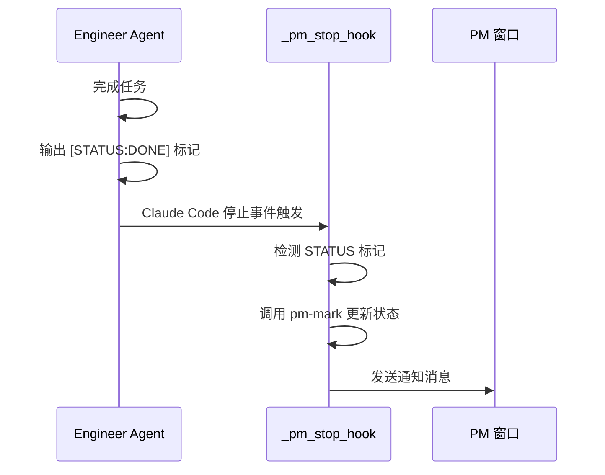

# hooks/ - Claude Code Hook 配置

> [<- 返回项目根目录](../CLAUDE.md)

## 模块概述

本目录包含 Claude Code Hook 的配置模板，用于实现 PM 监督模式下的状态推送功能。

## 目录结构



## 核心文件

| 文件 | 说明 |
|------|------|
| `settings.template.json` | Claude Code Stop Hook 配置模板 |

## Stop Hook 工作原理

### 架构



### 状态标记协议

Agent 在输出中使用以下标记向 PM 汇报状态：

| 标记 | 含义 | PM 行为 |
|------|------|---------|
| `[STATUS:DONE]` | 任务完成 | 标记为 done，发送通知 |
| `[STATUS:ERROR]` | 遇到错误 | 标记为 error，发送告警 |
| `[STATUS:BLOCKED]` | 任务阻塞 | 标记为 blocked，发送告警 |
| `[STATUS:PROGRESS]` | 进度更新 | 仅显示进度，不改变状态 |

### 配置方法

1. 将 `settings.template.json` 复制到目标项目的 `.claude/settings.json`
2. 确保 `~/.ai-automation.sh` 已加载（包含 `_pm_stop_hook` 函数）

```bash
# 复制配置模板
cp hooks/settings.template.json /path/to/project/.claude/settings.json
```

## 核心函数

Stop Hook 的核心逻辑在 `bashrc-ai-automation-v2.sh` 的 `_pm_stop_hook` 函数中：

```bash
_pm_stop_hook() {
    # 检测 Agent 输出中的 [STATUS:*] 标记
    # 自动调用 pm-mark 更新状态
    # 向 PM 窗口发送通知消息
    # 内置防抖机制（相同状态不重复通知）
}
```

## 使用示例

### Agent 端输出

```
正在实现用户登录 API...
已完成数据库模型...
已完成单元测试...

[STATUS:DONE] 用户登录 API 已完成，包含注册、登录、JWT 验证
```

### PM 端接收

PM 窗口将收到类似以下通知：

```
[dev-1] 状态更新: done
耗时: 15m23s
说明: 用户登录 API 已完成，包含注册、登录、JWT 验证
```

## 相关链接

- [PM 监督模式文档](../docs/03-pm-oversight-mode.md)
- [核心函数库](../bashrc-ai-automation-v2.sh) - `_pm_stop_hook` 函数实现
- [PM 槽位管理命令](../.claude/commands/tmuxAI/CLAUDE.md)
