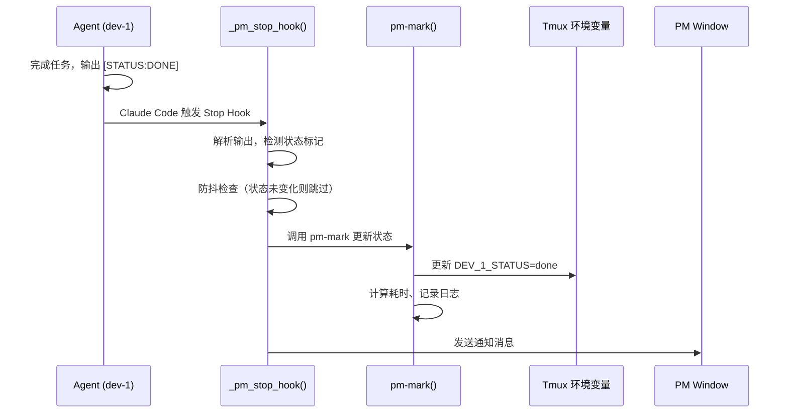

# hooks/ - Claude Code Hooks 集成

> [← 返回项目根目录](../CLAUDE.md)

## 模块概述

本目录包含与 Claude Code Hooks 系统集成的配置模板，实现**推送式状态变化通知**。

## 当前方案

**推荐方案：Bash 函数** (v1.5+)

核心逻辑已迁移到 `bashrc-ai-automation-v2.sh` 的 `_pm_stop_hook` 函数，复用现有 PM 函数。

## 文件列表

| 文件 | 用途 | 状态 |
|------|------|------|
| `settings.template.json` | Claude Code 配置模板 | 当前 |
| `pm-stop-hook.sh` | 独立脚本实现 | **DEPRECATED** |
| `CLAUDE.md` | 本文件 | - |

## 配置方法

### 1. 前提条件

创建符号链接（一次性设置）：

```bash
ln -s $TMUX_AI_TEAM_DIR/bashrc-ai-automation-v2.sh ~/.ai-automation.sh
```

### 2. 配置项目

将以下内容添加到目标项目的 `.claude/settings.json`：

```json
{
  "hooks": {
    "Stop": [
      {
        "hooks": [
          {
            "type": "command",
            "command": "bash -c 'source ~/.ai-automation.sh && _pm_stop_hook'",
            "timeout": 10000
          }
        ]
      }
    ]
  }
}
```

或复制模板：

```bash
cp $TMUX_AI_TEAM_DIR/hooks/settings.template.json <项目>/.claude/settings.json
```

## 工作原理



## 新旧方案对比

| 特性 | 旧方案 (独立脚本) | 新方案 (Bash 函数) |
|------|------------------|-------------------|
| 配置方式 | 脚本路径 | bash -c source |
| pm-mark 逻辑 | 重复实现 | 直接调用 |
| 耗时计算 | 无 | 自动获得 |
| 任务清空 | 无 | 自动获得 |
| 防抖机制 | 无 | 内置 |
| 维护位置 | 2 处 | 1 处 |

## 迁移指南

### 从旧脚本迁移

如果你的项目配置使用旧的脚本方式：

```json
// 旧配置 (DEPRECATED)
{
  "hooks": {
    "Stop": [{
      "hooks": [{
        "type": "command",
        "command": "$TMUX_AI_TEAM_DIR/hooks/pm-stop-hook.sh"
      }]
    }]
  }
}
```

请更新为：

```json
// 新配置 (推荐)
{
  "hooks": {
    "Stop": [{
      "hooks": [{
        "type": "command",
        "command": "bash -c 'source ~/.ai-automation.sh && _pm_stop_hook'",
        "timeout": 10000
      }]
    }]
  }
}
```

### 兼容性说明

旧脚本 `pm-stop-hook.sh` 仍然可用：
- 运行时会显示迁移提示
- 自动尝试调用新函数
- 如果新函数不可用，会降级到原有逻辑

## Hook 支持的状态标记

| 标记 | 触发动作 |
|------|----------|
| `[STATUS:DONE] 说明` | 更新状态为 done，通知 PM |
| `[STATUS:ERROR] 说明` | 更新状态为 error，通知 PM |
| `[STATUS:BLOCKED] 说明` | 更新状态为 blocked，通知 PM |

## 限制与注意事项

1. **Stop Hook 在每次响应后触发**：不是只在任务完成时，而是每次 Claude 回复后都会触发
2. **依赖 Agent 输出状态标记**：如果 Agent 不输出 `[STATUS:*]` 标记，Hook 不会更新状态
3. **需要在 tmux 会话中运行**：Hook 依赖 tmux 环境
4. **防抖机制**：相同状态不会重复更新和通知

## 调试

```bash
# 测试新函数（在 tmux 中）
source ~/.ai-automation.sh
_pm_stop_hook < /dev/null

# 查看 hook 日志
tail -f ~/.agent-logs/pm_*_*.log

# 检查 tmux 环境变量
tmux show-environment -t <session> | grep STATUS
```

## 相关文档

- [设计文档](../prompts/hook整合.md)
- [PM 监督模式](../docs/03-pm-oversight-mode.md)
