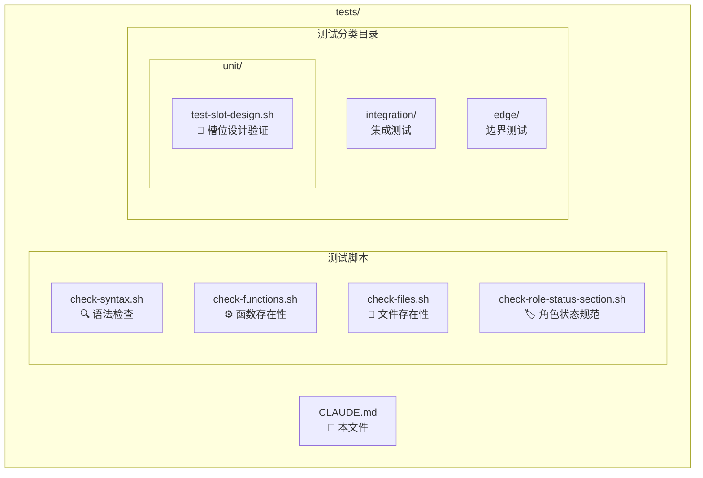

# tests/ - 测试模块

> [← 返回项目根目录](../CLAUDE.md)

## 模块概述

本目录包含 Tmux-AI-Team 项目的测试脚本，用于验证 Bash 函数库的正确性。

## 目录结构



## 测试脚本说明

| 脚本 | 用途 | 检查内容 |
|------|------|----------|
| `check-syntax.sh` | 语法验证 | `bash -n` 检查核心脚本语法 |
| `check-functions.sh` | 函数存在性 | 验证 PM 槽位管理函数是否已定义 |
| `check-files.sh` | 文件完整性 | 验证斜杠命令、角色命令、核心文件是否存在 |
| `check-role-status-section.sh` | 规范检查 | 验证角色命令包含 `[STATUS:*]` 标记规范 |

## 运行测试

```bash
# 运行所有基础测试
cd tests
./check-syntax.sh && ./check-functions.sh && ./check-files.sh && ./check-role-status-section.sh

# 运行单元测试
./unit/test-slot-design.sh

# 单独运行
./check-syntax.sh        # 语法检查
./check-functions.sh     # 函数存在性检查
./check-files.sh         # 文件存在性检查
./check-role-status-section.sh  # 角色状态规范检查

# 或从项目根目录运行
bash tests/check-syntax.sh
bash tests/unit/test-slot-design.sh
```

## 测试输出格式

所有测试脚本使用统一的输出格式：

```
=== 检查类型 ===
✓ 通过项描述
✗ 失败项描述

═══════════════════════════════════════════
结果: N 通过, M 失败
═══════════════════════════════════════════
```

退出码：`0` = 全部通过，`1` = 有失败项

## 测试分类目录

| 目录 | 状态 | 内容 |
|------|------|------|
| `unit/` | ✓ 已有测试 | `test-slot-design.sh` - 槽位设计验证 (44 测试点) |
| `integration/` | 空 | 集成测试：多函数协作测试 |
| `edge/` | 空 | 边界测试：极端情况和错误处理 |

### unit/test-slot-design.sh 测试内容

| 测试类别 | 验证内容 |
|----------|----------|
| 函数签名 | 13 个槽位管理函数是否已定义 |
| 参数验证 | 非 tmux 环境和无参数时的错误处理 |
| 槽位类型 | `--claude` 和 `--shell` 选项支持 |
| 状态值 | done/error/idle/blocked/ready 状态支持 |
| 变量转换 | 槽位名到环境变量名的转换逻辑 |
| 状态检测 | `[STATUS:*]` 标记的正则匹配 |
| 空闲检测 | Claude 版本信息、tokens、Shell 提示符模式 |
| 日志功能 | `_pm_log` 函数参数处理 |

## 待完善

- [x] 添加 PM 槽位管理函数的单元测试
- [ ] 添加 `fire` 函数的集成测试
- [ ] 添加通信函数 (`send-*`) 的测试
- [ ] 添加边界情况测试（无 tmux 会话、无效参数等）
- [ ] 添加 Hook 函数 (`_pm_stop_hook`) 的测试
